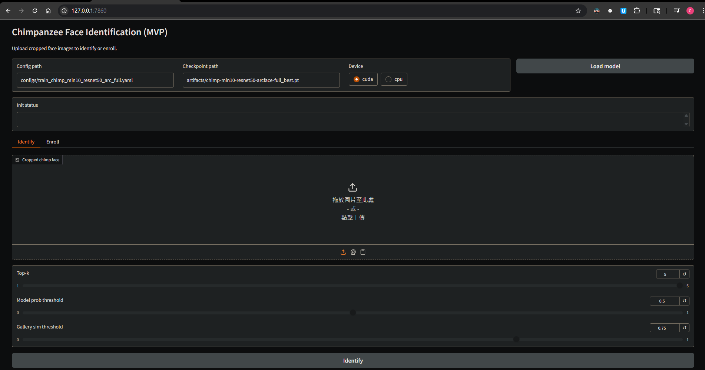
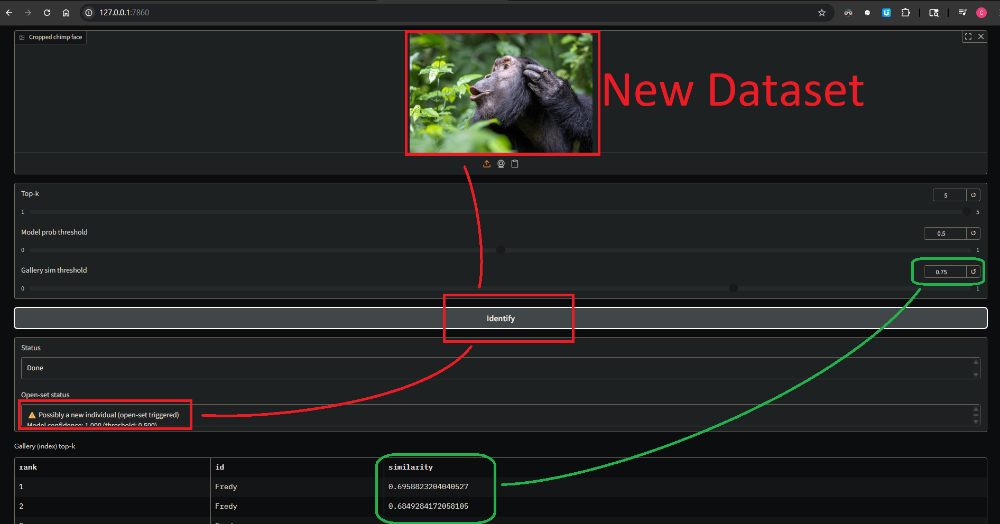
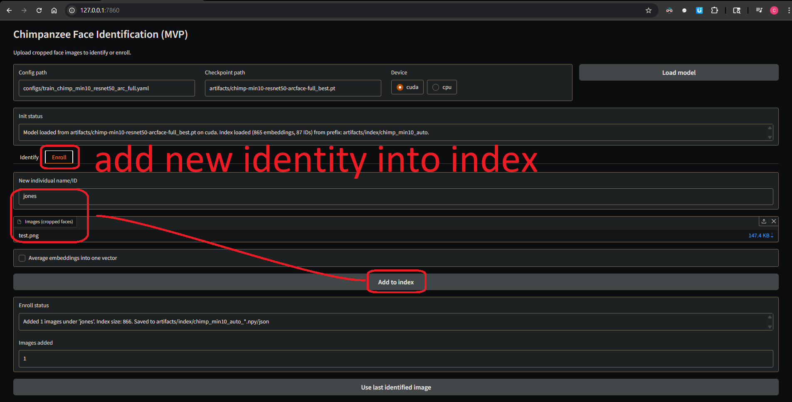

🌐 Languages:  
[English](./README.md) | [繁體中文](./README_zh-Hant.md)

# Animal Face Identification

This repository contains a proof-of-concept pipeline for animal face identification using PyTorch. It is designed for closed-set identification (recognizing known individuals) and is built with components to support future open-set and enrollment workflows.

The current implementation focuses on identifying individual chimpanzees using the [Chimpanzee Faces](https://github.com/cvjena/chimpanzee_faces) dataset.

## GUI Overview

Here is a quick visual guide to the GUI application (`tools/chimp_gui_app.py`).

### 1. Initial View
The initial interface before loading a model. It shows the configuration path, checkpoint path, device selector (CUDA/CPU), and the empty "Identify" tab with its drag-and-drop upload area.



### 2. Enroll a New Individual
The "Enroll" workflow allows a user to add a new individual to the recognition index. The user provides a name/ID, uploads one or more cropped face images, and clicks "Add to index." The index is updated and saved automatically.


### 3. Identify a Known Individual
This shows a result for a known individual. Both the model's confidence and the gallery similarity score exceed their respective thresholds. The system returns "Known individual (confidence above thresholds)" and lists the top matching candidates from the gallery.



### 4. Identify an Unknown Individual (Open-Set)
This shows a result for a new or unknown individual. Although the model's classification confidence is high, the similarity to the closest face in the gallery is below the threshold (e.g., < 0.75). This triggers the open-set logic, and the system displays "Possibly a new individual (open-set triggered)."



## Features

- **End-to-End Workflow**: Covers the full pipeline from data preparation to training, evaluation, and inference.
- **Configuration-Driven**: All experiments are controlled via simple YAML configuration files.
- **High-Performance Models**: Includes configurations for ResNet backbones with ArcFace loss, a standard for face recognition tasks.
- **Reproducibility**: Provides scripts and fixed seeds to ensure that data splits and training runs are reproducible.

---

## Project Status: High-Performance Model Trained

**As of November 2025, a high-performance chimpanzee recognition model has been successfully trained.**

- **Model:** `ResNet50` backbone with an `ArcFace` head.
- **Training:** Full run on the `min10` dataset (200 epochs, config `configs/train_chimp_min10_resnet50_arc_full.yaml`).
- **Result:** Best checkpoint: `artifacts/chimp-min10-resnet50-arcface-full_best.pt`. Ready for evaluation and inference.

## Dataset Notes (why “min10”)

- `annotations_merged_all.txt`: 7,187 images, 102 IDs, includes classes with very few samples.
- `annotations_merged_min10.txt`: 7,150 images, 87 IDs, every ID has ≥10 images.
- We train/evaluate on **min10** to avoid extremely low-sample classes, improve class balance, and stabilize ArcFace training/eval. Use `annotations_merged_all.txt` only if you explicitly want the long-tail classes (expect more imbalance and weaker per-ID metrics).

---

## Conceptual Overview

This project involves several key deep learning concepts. For a detailed explanation of the project's architecture and answers to common questions, please read our new guide:

**➡️ [Conceptual Overview & FAQ](./docs/CONCEPTS.md)**

This guide answers questions such as:

- How does the model "remember" new faces without full retraining?
- What is the difference between the GPU's role in training vs. the CPU's role in inference?
- Why is this model a "chimpanzee expert" and what are its limitations?

---

## Documentation

This project is organized into a series of detailed guides. Start with setting up your environment and follow the steps in order.

| #   | Guide                                                              | Description                                                         |
| --- | ------------------------------------------------------------------ | ------------------------------------------------------------------- |
| 1   | **[Environment Setup](./docs/SETUP.md)**                           | How to configure your Python environment on Windows, WSL, or macOS. |
| 2   | **[Data Preparation](./docs/DATA_PREPARATION.md)**                 | How to download, validate, and prepare the dataset for training.    |
| 3   | **[Model Training](./docs/TRAINING.md)**                           | How to run the training script and understand the outputs.          |
| 4   | **[Evaluation and Inference](./docs/EVALUATION_AND_INFERENCE.md)** | How to evaluate your trained model and predict new images.          |

---

## 🚀 First-Time Setup: Get Started in 5 Steps

**New to this repository?** Follow these steps to set up your environment and run the GUI application:

### Step 1: Create a Virtual Environment

**On Linux/macOS/WSL:**

```bash
python3 -m venv .venv
```

**On Windows (Command Prompt or PowerShell):**

```cmd
python -m venv .venv
```

### Step 2: Activate the Virtual Environment

**On Linux/macOS/WSL:**

```bash
source .venv/bin/activate
```

**On Windows (Command Prompt):**

```cmd
.venv\Scripts\activate.bat
```

**On Windows (PowerShell):**

```powershell
.venv\Scripts\Activate.ps1
```

### Step 3: Upgrade pip

```bash
pip install --upgrade pip
```

### Step 4: Install Dependencies

```bash
pip install -r requirements.txt
```

### Step 5: Run the GUI Application

```bash
python tools/chimp_gui_app.py
```

### Step 6: Open in Browser

Open your browser and navigate to:

```
http://127.0.0.1:7860
```

🎉 **You're ready to go!** The GUI allows you to identify chimpanzees and enroll new individuals.

> **Note:** For the GUI to work properly, make sure you have obtained the pre-trained model and dataset (see section below).

---

## Quick Start: Using Pre-trained Models and Datasets

**Don't want to train from scratch?** You can get started faster by obtaining pre-prepared resources:

### Option A: Get Pre-trained Model (artifacts/)

- **Contact Jones** to request the trained model artifacts ZIP file
- Extract and overwrite the `artifacts/` directory
- This includes the best checkpoint (`chimp-min10-resnet50-arcface-full_best.pt`) and gallery index

### Option B: Get Dataset (data/)

You have two options for the chimpanzee dataset:

1. **Download directly** from the official source: [cvjena/chimpanzee_faces](https://github.com/cvjena/chimpanzee_faces)
2. **Contact Jones** to request the prepared dataset ZIP file for easier setup

After obtaining either or both, you can skip directly to evaluation/inference steps below.

---

## How to Run: The Full Workflow

Here is the complete sequence of commands to go from a fresh clone to making a prediction.

### 1. Setup and Data Prep

_Ensure you have completed the steps in the [Environment Setup](./docs/SETUP.md) and [Data Preparation](./docs/DATA_PREPARATION.md) guides first._

```bash
# Activate your virtual environment (e.g., on Linux/WSL/macOS)
source .venv/bin/activate

# 1. Validate that your dataset is structured correctly
python validate_dataset.py

# 2. Create the train/validation/test split file (only needs to be run once)
python scripts/prepare_chimpanzee_splits.py
```

### 2. Train the Model

_For details, see the [Model Training](./docs/TRAINING.md) guide._

```bash
# Run a full training using the high-performance configuration
python -m src.training.train --config configs/train_chimp_min10_resnet50_arc_full.yaml
```

### 3. Build Gallery and Predict

_For details, see the [Evaluation and Inference](./docs/EVALUATION_AND_INFERENCE.md) guide._

```bash
# 1. Build the k-NN gallery index from your trained model
python -m src.inference.build_gallery --config configs/train_chimp_min10_resnet50_arc_full.yaml --device cuda

# 2. Predict the ID of a new image
 python -m src.inference.predict --image /path/to/your/chimp_face.png --config configs/train_chimp_min10_resnet50_arc_full.yaml --device cpu
```

### 4. Final Evaluation on Test Split

```bash
python tools/run_final_eval.py \
  --config configs/train_chimp_min10_resnet50_arc_full.yaml \
  --ckpt artifacts/chimp-min10-resnet50-arcface-full_best.pt \
  --device cuda
```

Outputs go to `artifacts/final_eval/` and `FINAL_EVAL_REPORT.md`.

### 5. GUI (experimental)

```bash
python tools/chimp_gui_app.py
```

Default config/ckpt from above; uses index at `artifacts/index/chimp_index` if present. Identify tab shows model + gallery top-k; Enroll tab adds new individuals to the index.

### 6. Auto-build gallery index from annotations

```bash
python tools/build_chimp_index_from_annotations.py \
  --max-per-id 10 \
  --device cuda \
  --prefix artifacts/index/chimp_min10_auto
```

- Auto-picks the min10 annotation, uses train+val as gallery (test held out), caps per-ID samples, batches embeddings with the full model.
- Saves index to `artifacts/index/chimp_min10_auto_*` and entries CSV; GUI will auto-load this index if present.

### 7. Open-set hinting in GUI
- Identify tab shows an “Open-set status” using both model top-1 confidence and gallery top-1 similarity.
- Default thresholds (adjustable via sliders): model prob 0.5, gallery sim 0.75. If either is below threshold, the GUI warns “possibly a new individual” and you can send the last identified image directly to Enroll without re-upload.


---

## Repository Structure

```
.
├── artifacts/              # Output folder for models (.pt) and logs (.csv)
│                           # 💡 TIP: Contact Jones for pre-trained model ZIP to skip training
├── configs/                # YAML configuration files for training runs
├── data/
│   ├── chimpanzee_faces/
│   │   ├── annotations/    # Annotation files and generated splits.json
│   │   └── raw/            # Location for the downloaded image dataset (ignored by Git)
│   │                       # 💡 TIP: Get from https://github.com/cvjena/chimpanzee_faces
│   │                       #        or contact Jones for prepared dataset ZIP
├── docs/                   # Detailed documentation guides
├── scripts/                # Helper scripts (e.g., for preparing data splits)
├── src/                    # Main source code
│   ├── datasets/           # Dataloaders
│   ├── inference/          # Inference scripts (prediction, gallery building)
│   ├── models/             # Model definitions (backbones, heads, losses)
│   └── training/           # Training and evaluation logic
├── tools/                  # Standalone tools (e.g., final evaluation script)
└── README.md               # This file
```

---

## 🧭 Roadmap / Next Steps

### Open-Set Recognition

**Currently Supported:**

- ✅ **Known individual identification** (model top-k)
- ✅ **Gallery nearest neighbor search** (index kNN)
- ✅ **Enrolling new individuals** (Enroll tab)
- ✅ **Open-set hinting** (Identify tab warns when model prob < 0.5 or gallery sim < 0.75; can send last image to Enroll)

**Not Yet Supported:** Face detection / cropping before ID (current GUI assumes pre-cropped faces).

### 🎯 Next Milestones
- **Face detection + crop before ID (high priority):** Add a detector stage (e.g., RetinaFace) so the pipeline handles real-world photos (trap cams, zoo CCTV, researcher shots) by auto-finding faces, then reusing the existing embedding + index stack.
- **Optional:** More advanced open-set (calibration, logging, “ambiguous” buffer/review flows) building on the current M1 open-set hinting.
