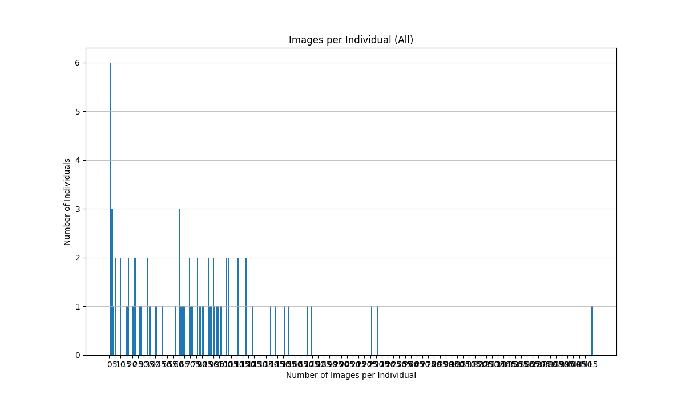
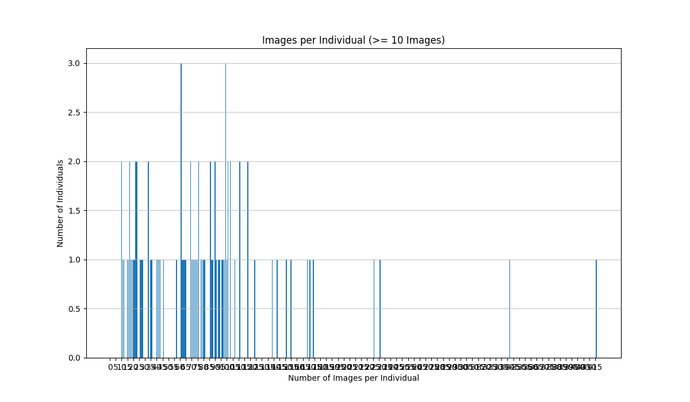

# Data Analysis Report: Chimpanzee Faces Dataset

This report provides a statistical overview of the Chimpanzee Faces dataset, which is composed of images from two sources: CZoo and CTai. The analysis covers the full dataset and a filtered subset suitable for deep learning tasks.

The dataset is structured as follows:
- `datasets_cropped_chimpanzee_faces/data_CZoo/`: Contains images and annotations for the CZoo collection.
- `datasets_cropped_chimpanzee_faces/data_CTai/`: Contains images and annotations for the CTai collection.

## Statistics — All Individuals

- **Total number of unique individuals:** 102
- **Image count statistics per individual:**
  - **Mean:** 70.46
  - **Median:** 67.00
  - **Min:** 1
  - **Max:** 416

A histogram showing the distribution of images per individual across the entire dataset is saved as `images_per_individual_histogram_all.png`.

## Statistics — Filtered (≥ 10 images per individual)

To create a more balanced dataset for training, we filter out individuals with fewer than 10 images.

- **Threshold used:** 10 images
- **Number of kept individuals:** 87
- **Number of dropped individuals:** 15
- **Image count statistics in the filtered subset:**
  - **Mean:** 82.18
  - **Median:** 75.00
  - **Min:** 10
  - **Max:** 416

A histogram for this filtered subset is saved as `images_per_individual_histogram_min10.png`.

## Notable Individual Groups

- **Individuals with fewer than 5 images (13):**
  - `Akouba, Baloo, Danane, Diva, Fatima, Freddy, Ibrahiim, Liliou, Marc, Olduvai, Voodoo, Wapii, Woodstiock`
- **Individuals with more than 50 images (59):**
  - `Adult, Akrouba, Akwaba, Alex, Alexandra, Annett, Athena, Atra, Bangolo, Caramel, Coco, Corrie, Dorien, Duna, Eva, Fifi, Fraukje, Fredy, Frodo, Gertrudia, Haraka, Isha, Jacobo, Jahaga, Julia, Kaos, Kara, Kinshasa, Kiriku, Kofi, Kuba, Lilou, Lobo, Lome, Louise, Lucas, Mkubwa, Natascha, Olivia, Oscar, Patrick, Pia, Riet, Robert, Sagu, Sandra, Sassandra, Shogun, Sumatra, Swela, Tai, Ulla, Utan, Victor, Wala, Wapi, Woodstock, Zora, Zyon`

## Suitability for Deep Learning

The filtered dataset (with ≥ 10 images per individual) is significantly more suitable for deep learning tasks that rely on recognizing individuals.

- **For classification-based metric learning (e.g., ArcFace, CosFace, SphereFace):** These methods train a classifier to distinguish between identities. Individuals with very few images (e.g., 1-5) provide insufficient data for the model to learn robust, generalizable features for that class, leading to poor convergence and performance. The filtered set ensures each identity has enough examples.

- **For triplet loss:** This method learns an embedding by comparing an "anchor" image to "positive" (same identity) and "negative" (different identity) examples. To form valid triplets, at least two images are required for any given individual. While technically possible with just two images, having a richer set of 10 or more images allows for more diverse and effective triplet sampling (e.g., hard-positive and hard-negative mining), which is crucial for training a high-performance model.

Dropping individuals with few samples is a standard practice to improve model stability and ensure that the learned embeddings are based on representative data for each identity.
